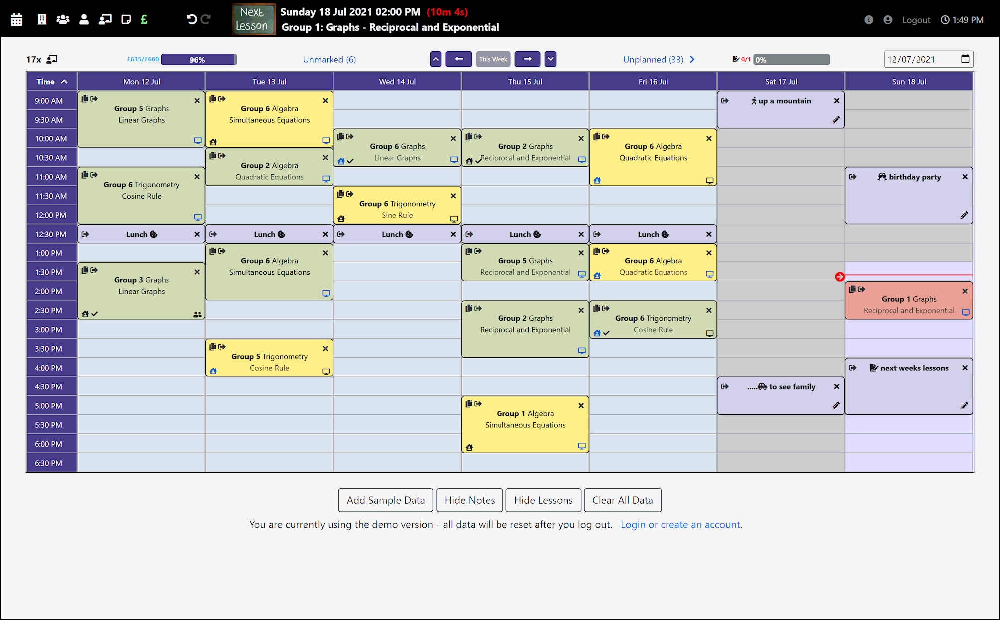
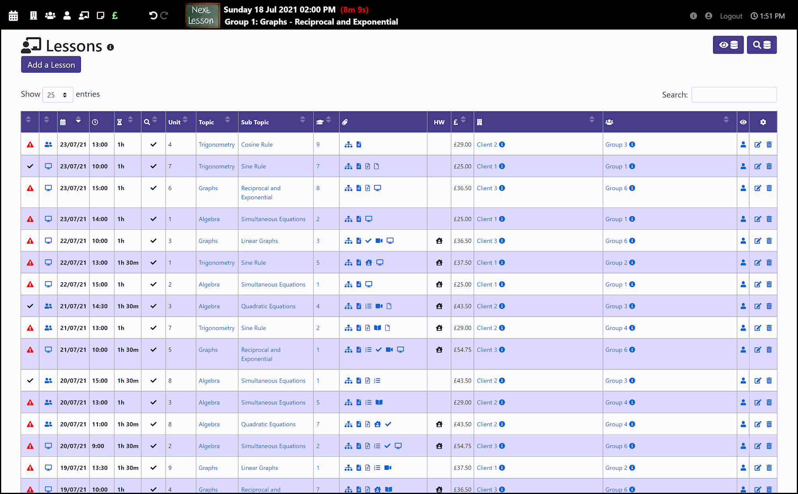
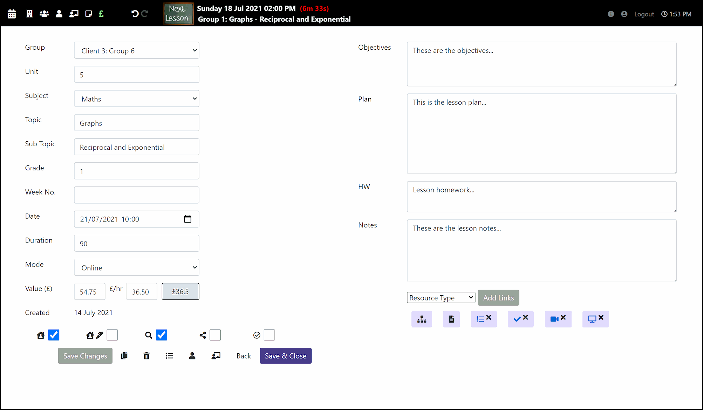
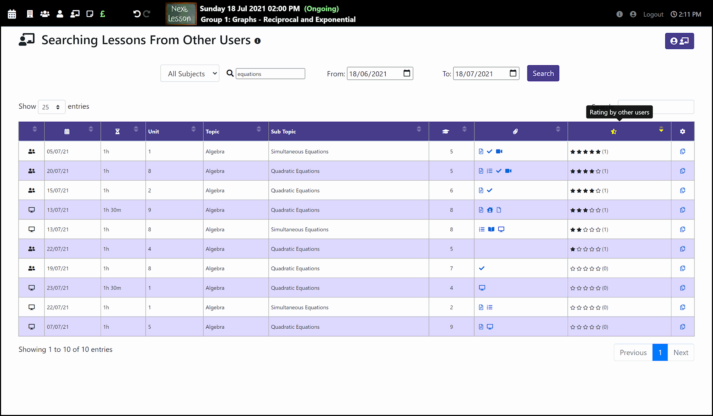
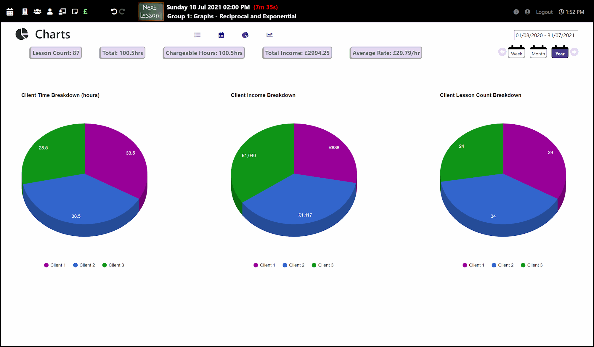

# Lesson Planner

An ASP.NET Web Application to Assist Tutors and Teachers with Timetabling and Lesson Planning

## Table of contents

- [General Information](#general-information)
- [Sample Images](#sample-images)
- [Technologies Used](#technologies-used)
- [Setup](#setup)
- [Comments](#comments)
- [Current Status](#current-status)
- [Contact](#contact)

## General information

This aim of this project is to create an application that improves the productivity of educators (particularly private tutors) in planning and organising lessons. Information is stored in an Azure-based relational SQLite database with individual user accounts. Data is structured in tables representing clients, learning groups, learners, lessons, lesson reviews and notes. There are also tables to facilitate undo and redo functions.

Users can create an account using the standard ASP.NET Identity system, or demo the application without logging in using the premade guest account. They can perform the standard CRUD operations on each entity (clients, groups, etc) via the dedicated controller index pages. In addition, the home page includes an interactive calendar where lessons and notes can be moved, copied and manipulated by clicking or dragging elements. There is also a controller that handles GET requests for financial information, which can be used for income analysis or invoicing purposes.

Users have the option to share their lesson plans with other users, creating a bank of communal resources. They can rate the lessons of other users to help promote the most useful content.

## Sample Images

#### Home (timetable) page:

#### Lesson Index:

#### Lesson Editor:

#### Database Lesson Search:

#### Finance Charts:

## Technologies Used

- ASP.NET Core MVC
- Entity Framework Core / LINQ
- SQLite
- Azure
- jQuery

## Setup

The application is hosted using Azure at https://lessonplanner.azurewebsites.net.

## Comments

Positive Aspects:

- All information regarding a lesson such as the topic, plan, links to presentations, online classrooms, etc are centralised to improve lesson planning efficiency.
- The timetable page makes lesson manipulation more user-friendly
- Useful database fields were chosen with feedback from a private tutor (though some may not be necessary for all users)
- The next upcoming lesson is always visible at the top of the page, with a countdown to the start time

New features that could be added / things that may be improved in future:

- A slight delay occurs when rendering the lesson list page, due to the time taken to fill MDBootsrap tables (as opposed to database round-trip time)
- The next upcoming lesson partial is updated using a database call every time the url changes. This is only really necessary when data has actually been modified
- Mobile devices are not supported, mainly because it is not practical to fit all of the UI elements needed to provide functionality into a narrow viewport.

## Current Status

The application is currently active and in use. New features will be added in response to user feedback.

## Contact

For more information, please contact [@JakeMatthewsUK](https://www.jakematthews.uk/).